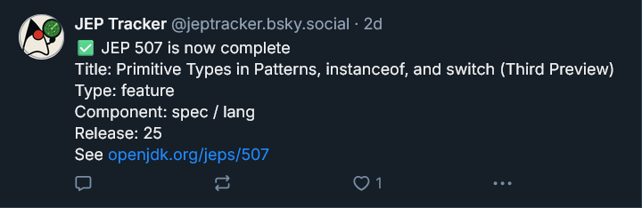

# JEP Tracker: an OpenJDK JEP Bluesky Bot

This [@jeptracker.bsky.social bot](https://bsky.app/profile/jeptracker.bsky.social) monitors [OpenJDK JEP (Java Enhancement Proposal)](https://openjdk.org/jeps/0) statuses and posts updates to Bluesky when changes are detected.



## Development

### Prerequisites

- Java 21 or later
- Maven
- A Bluesky account

### Setup

1. Clone the repository:
```bash
git clone https://github.com/yourusername/openjdk-jep-bsky.git
cd openjdk-jep-bsky
```

2. Configure your Bluesky credentials in `src/main/resources/application.properties`:
```properties
bluesky.handle=your.handle.bsky.social
bluesky.app-password=your-app-password
```

3. Run the application:
```bash
./mvnw quarkus:dev
```
## Deployment

### Using Docker

Create a volume to store JEP database, and run `ghcr.io/PerfectSlayer/openjdk-jep-bsky` image:

```shell
docker volume create jep-tracker-db
docker run -d
  -name jep-tracker \
  -v jep-tracker-db:/app/db \
  ghcr.io/PerfectSlayer/openjdk-jep-bsky:master 
```

## License

This project is licensed under the GNU General Public License v3.0 - see [the LICENSE file](LICENSE.md) for details.


